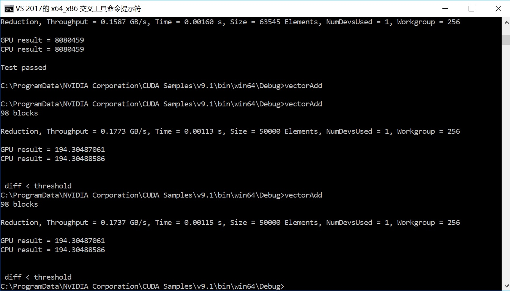

### simple reduce
   
The content for this sample is in vectorAdd.cu

Reduction simply computes the sum of all the elements in the array on the device (GPU) and feeds back to the host (CPU). There are multiple versions
of the reduction operation spanning multiple samples in the CUDA SDK, this one was chosen after a series of simple tests, and because it
offers flexibility in the size of the arrays that are reduced (i.e. not only a power of 2) and decent performance without the
reported problem of memory read clashes. 

See the sample named "reduction" in the CUDA SDK for more information.

</img>